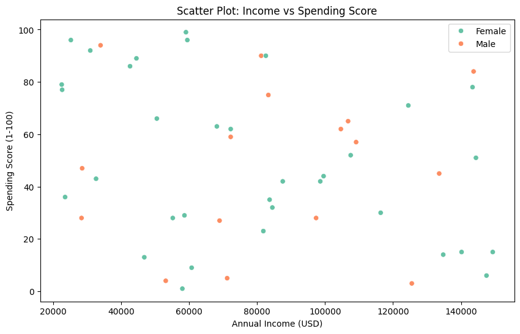

# Customer-Segmentation-Analysis
## 📌 Project Overview  
This project analyzes customer purchasing behavior using segmentation techniques.  
It helps businesses understand which **customer groups spend the most** and which **group to target for marketing**.  

## 📂 Project Structure  
```
📂 Customer_Segmentation_Analysis  
│── 📂 data/ → Contains the dataset (CSV file)  
│── 📂 notebooks/ → Contains the Colab notebook  
│── 📂 images/ → Contains saved charts & visualizations  
│── 📜 README.md → Project documentation  
```

## 📊 Key Findings  
- **Low-income groups spend the most**  
- **Young age group has the lowest sales** (best for marketing)  

## 🔧 Tools & Technologies Used  
- Python (Pandas, NumPy, Matplotlib, Seaborn)  
- Google Colab  

## 📈 Visualizations  
Here are some key visualizations from the project:  
  

## 🚀 How to Use This Project  
1. Clone the repository:  
   ```
   git clone <your-repo-link>
   ```
2. Install dependencies:  
   ```
   pip install -r requirements.txt
   ```
3. Open the Jupyter Notebook and run the analysis.  
---

### **✅ Step 5: Create `requirements.txt`**  
This file lists all the libraries required to run your project.  

Here’s your `requirements.txt`:  

```
pandas  
numpy  
matplotlib  
seaborn  
```

---

